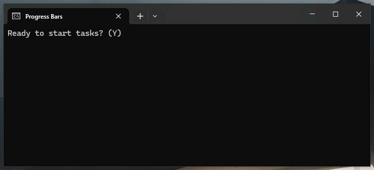

## ⌛ Stacked Progress Bars 

Simplified stacked progress bars implementation for console applications.


``` pascal
uses Console.ProgressBar;

Line := 1; 
Total := 1000; 
for i := 0 to Total do
    ConsoleProgressBar(i, Total, Line);
```

### Basic stacked bars
You can use stacked bars as long as you draw them on different lines in the console.
``` pascal
uses Console.ProgressBar;

for i := 1 to 1000 do
    ConsoleProgressBar(i, 1000, 1); // runs at line 1
    
for i := 1 to 2000 do
    ConsoleProgressBar(i, 2000, 2); // runs at line 2

```
### Advanced options

``` pascal
 ConsoleProgressBar(
    i,     
    Total, 
    2,          
    'Sign',     // label
    '☢',       // emoji
    False,      // progress indicator
    92,         // foreground bar color
    50,         // background bar color
    59          // customized dynamic size
    '='         // custom bar char
);
```
### Bar length and char customization:

``` pascal
  ConsoleBarWidth := 50;
  ConsoleBarChar := '#';
```

### Foreground and backgroud colors
Foreground and background colors can follow the index from 0 to 255 as shown in this table. 


_Source: https://gist.github.com/fnky/458719343aabd01cfb17a3a4f7296797_


