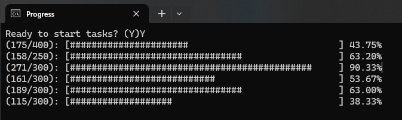

## ⌛ Concurrent Progress Bars 

Simplified implementation of concurrent progress bars for a console application.

``` pascal
uses
    Console.ProgressBar;

begin
    Line := 1; //Progress bar location in the console window. 
    Total := 1000; //Progress bar length
    for i := 0 to Total do
        ConsoleProgressBar(i, Total, Line);
end;
```

You can use concurrent progress bars as long as you specify different line locations for them.

``` pascal
uses
    System.Threading,
    Console.ProgressBar;

var
    Task1, Task2: ITask;

begin
    Task1 := TTask.Create(procedure 
    var i: Integer;
    begin
        for i := 1 to 1000 do
            ConsoleProgressBar(i, 1000, 1); // runs at line 1
    end);

    Task2 := TTask.Create(procedure 
    var i: Integer;
    begin
        for i := 1 to 2000 do
            ConsoleProgressBar(i, 2000, 2); // runs at line 2
    end);

    //Other tasks...

end;
```

Result:



## Bar length and char customization:

``` pascal
  ConsoleBarWidth := 50;
  ConsoleBarChar := '#';
```