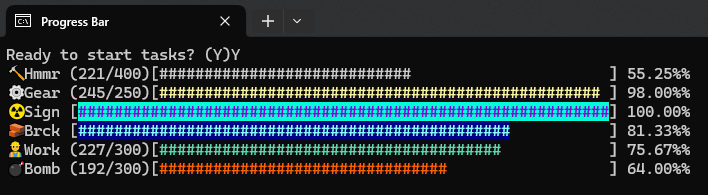
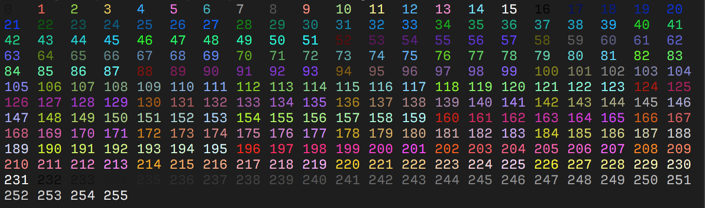

## ⌛ Concurrent Progress Bars 

Simplified implementation of concurrent progress bars for a console application.


``` pascal
uses
    Console.ProgressBar;

begin
    Line := 1; //Progress bar location in the console window. 
    Total := 1000; //Progress bar length
    for i := 0 to Total do
        ConsoleProgressBar(i, Total, Line);
end;
```

### 📚 Basic stacked bars
You can use stacked bars as long as you specify different lines for them.
``` pascal
uses
    System.Threading,
    Console.ProgressBar;

var
    Task1, Task2: ITask;

begin
    Task1 := TTask.Create(procedure 
    var i: Integer;
    begin
        for i := 1 to 1000 do
            ConsoleProgressBar(i, 1000, 1); // runs at line 1
    end);

    Task2 := TTask.Create(procedure 
    var i: Integer;
    begin
        for i := 1 to 2000 do
            ConsoleProgressBar(i, 2000, 2); // runs at line 2
    end);

    //Other tasks & bars...

end;
```
### ⚙ Advanced options

``` pascal
uses
    System.Threading,
    Console.ProgressBar;

var
    Task1, Task2: ITask;

begin

    Task1 := TTask.Create(procedure 
    var i: Integer;
    begin
        Total := 1000;
        for i := 1 to Total do
            ConsoleProgressBar(i, Total, 1, 'Test', '🔨'); //With Title and Emoji
    end);

    Task2 := TTask.Create(procedure 
    var i: Integer;
    begin
        Total := 2000;
        for i := 1 to Total do
            ConsoleProgressBar(
                i,     
                Total, 
                2,          // line
                'Sign',     // label
                '☢',       // emoji
                92,         // foreground bar color
                50,         // background bar color
                False,      // show progress label
                59          // customized dynamic size
            );
    end);

    //Other tasks...

end;
```
### 📏 Bar's length and char customization:

``` pascal
  ConsoleBarWidth := 50;
  ConsoleBarChar := '#';
```

### 🎨 Foreground and backgroud colors
The bar's foreground and background colors can follow the index from 0 to 255 as shown in this table. More advanced options can be found [here](https://gist.github.com/fnky/458719343aabd01cfb17a3a4f7296797).


_Source: https://gist.github.com/fnky/458719343aabd01cfb17a3a4f7296797_

### 📌 Summary
This project is aimed on education purposes. It will not work if the console does not support utf-8 or advanced ascii escape sequences. There are other issues which haven't been addressed (yet), so it might also not properly work under all scenarios of a console app.<br>


